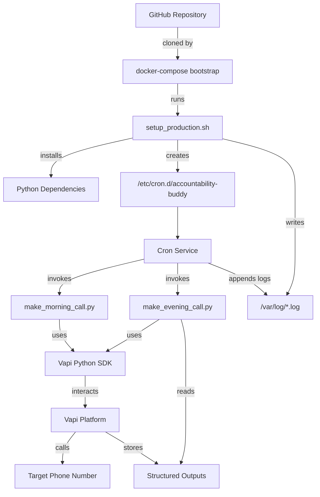

```mermaid
%% Accountability Buddy dependency graph
graph TD
    Repo["GitHub Repository"] -- cloned by --> Docker["docker-compose bootstrap"]
    Docker -- runs --> SetupProd["setup_production.sh"]
    SetupProd -- installs --> PythonDeps["Python Dependencies"]
    SetupProd -- creates --> CronFile["/etc/cron.d/accountability-buddy"]
    CronFile --> CronSvc["Cron Service"]
    CronSvc -- invokes --> Morning["make_morning_call.py"]
    CronSvc -- invokes --> Evening["make_evening_call.py"]
    Morning -- uses --> VapiSDK["Vapi Python SDK"]
    Evening -- uses --> VapiSDK
    VapiSDK -- interacts --> VapiAPI["Vapi Platform"]
    VapiAPI -- calls --> Phone["Target Phone Number"]
    VapiAPI -- stores --> Goals["Structured Outputs"]
    Evening -- reads --> Goals
    SetupProd -- writes --> Logs["/var/log/*.log"]
    CronSvc -- appends logs --> Logs
```
