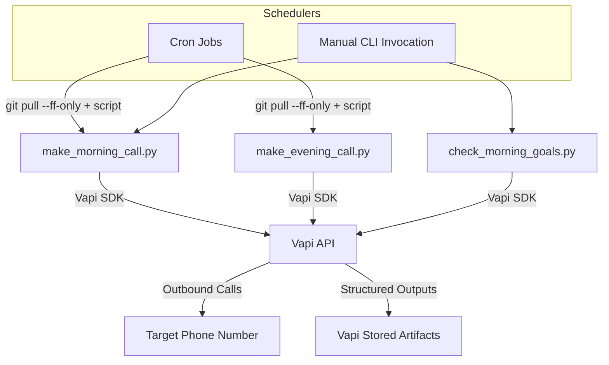

```mermaid
%% Accountability Buddy execution flow
flowchart TD
    subgraph Schedulers
        Cron[Cron Jobs]
        CLI[Manual CLI Invocation]
    end

    Cron -->|git pull --ff-only + script| Morning[make_morning_call.py]
    Cron -->|git pull --ff-only + script| Evening[make_evening_call.py]
    CLI --> Morning
    CLI --> EveningCheck[check_morning_goals.py]

    Morning -->|Vapi SDK| VapiAPI[Vapi API]
    Evening -->|Vapi SDK| VapiAPI
    EveningCheck -->|Vapi SDK| VapiAPI

    VapiAPI -->|Outbound Calls| Phone[Target Phone Number]
    VapiAPI -->|Structured Outputs| Storage[Vapi Stored Artifacts]
```
