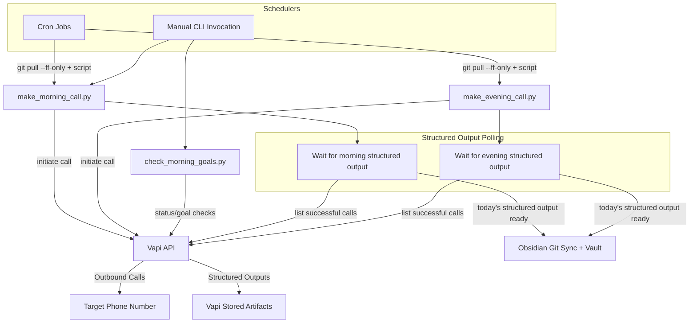

```mermaid
%% Accountability Buddy execution flow
flowchart TD
    subgraph Schedulers
        Cron[Cron Jobs]
        CLI[Manual CLI Invocation]
    end

    Cron -->|git pull --ff-only + script| Morning[make_morning_call.py]
    Cron -->|git pull --ff-only + script| Evening[make_evening_call.py]
    CLI --> Morning
    CLI --> EveningCheck[check_morning_goals.py]

    Morning -->|initiate call| VapiAPI[Vapi API]
    Evening -->|initiate call| VapiAPI
    EveningCheck -->|status/goal checks| VapiAPI

    subgraph Polling["Structured Output Polling"]
        MorningPoll[Wait for morning structured output]
        EveningPoll[Wait for evening structured output]
    end

    Morning --> MorningPoll
    Evening --> EveningPoll

    MorningPoll -->|list successful calls| VapiAPI
    EveningPoll -->|list successful calls| VapiAPI

    VapiAPI -->|Outbound Calls| Phone[Target Phone Number]
    VapiAPI -->|Structured Outputs| Storage[Vapi Stored Artifacts]

    MorningPoll -->|today's structured output ready| ObsidianSync[Obsidian Git Sync + Vault]
    EveningPoll -->|today's structured output ready| ObsidianSync
```
